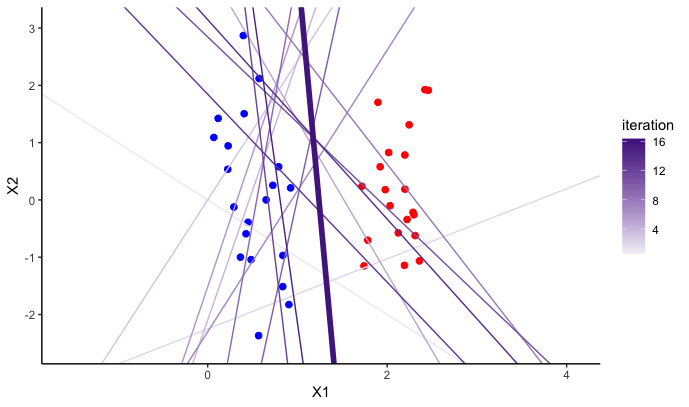

# perceptron

Package to visualize the perceptron algorithm

Example showing all iterations:

[without code](https://github.com/jtr13/perceptron/blob/master/inst/perceptron_echo_FALSE.pdf)

[with code](https://github.com/jtr13/perceptron/blob/master/inst/perceptron_echo_TRUE.pdf)

